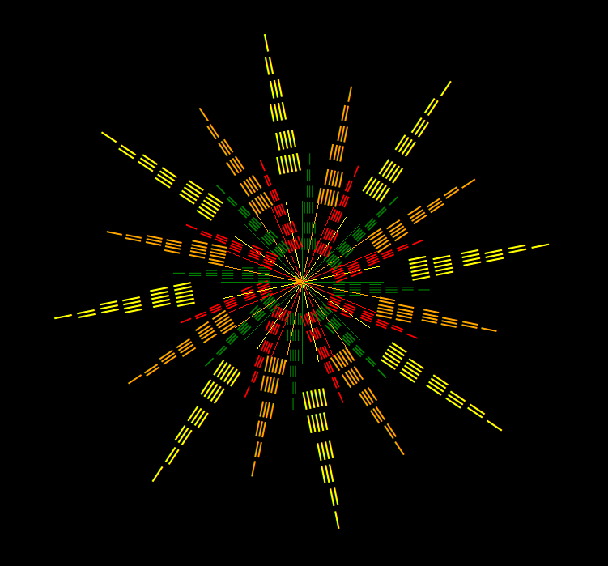

# Python3-Turtle-Module
With Python 3.9 standard installation coming turtle module does not support drawing of rotated texts. 

With help of the turtle_C module or the Patch you can use in your turtle script `,txt_angle=` as parameter in order to draw rotated texts.

The Patch if run as `__main__` demonstrates usage of the added feature creating out the text `'𝄖 𝄗 𝄘 𝄙  𝄚 𝄛'` following graphics: 

